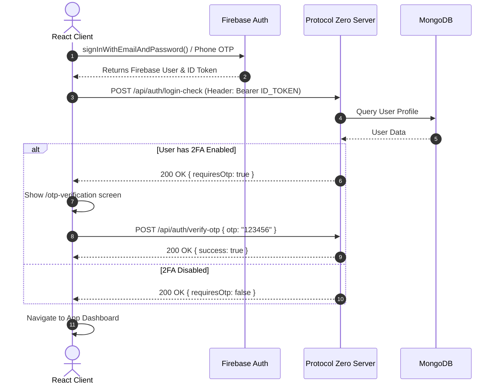

# Protocol Zero API Reference & Integration Guide

> **Base URL:** `http://localhost:5000/api`  
> **Headers Required for All Protected Routes:**  
> `Authorization: Bearer <FIREBASE_ID_TOKEN>`  
> `Content-Type: application/json`

---

## 🔑 Authentication & Authorization Guide

### 1. How Client-Side Authentication Works (Firebase Integration)
Protocol Zero uses **Firebase Authentication** for identity verification (Email/Password or Firebase Phone OTP).

#### **Step 1: Sign in with Firebase**
On the React frontend, authenticate the user using the Firebase Client SDK:
```javascript
import { getAuth, signInWithEmailAndPassword } from "firebase/auth";

const auth = getAuth();
const userCredential = await signInWithEmailAndPassword(auth, email, password);
```

#### **Step 2: Retrieve the Firebase Bearer Token**
Extract the raw JWT ID token directly from the authenticated Firebase user instance:
```javascript
const idToken = await auth.currentUser.getIdToken();
```

#### **Step 3: Attach Authorization Header to API Requests**
Include the token in the `Authorization` header as `Bearer <token>`:
```javascript
import axios from "axios";

const response = await axios.get("http://localhost:5000/api/reports", {
  headers: {
    Authorization: `Bearer ${idToken}`,
  },
});
```

---

### 2. Recommended Axios Interceptor Setup (Automatic Token Injection & Refresh)
Instead of manually passing the token on every API call, configure an Axios instance interceptor. Firebase SDK handles token refresh automatically under the hood:

```javascript
import axios from "axios";
import { getAuth } from "firebase/auth";

const api = axios.create({
  baseURL: "http://localhost:5000/api",
});

// Automatically inject fresh Firebase ID Token into every outgoing request
api.interceptors.request.use(async (config) => {
  const auth = getAuth();
  const user = auth.currentUser;
  if (user) {
    const token = await user.getIdToken(/* forceRefresh */ false);
    config.headers.Authorization = `Bearer ${token}`;
  }
  return config;
}, (error) => Promise.reject(error));

// Handle 401 Unauthorized globally (e.g. session expiration)
api.interceptors.response.use(
  (response) => response,
  (error) => {
    if (error.response?.status === 401) {
      // Clear local state and redirect to login
      console.warn("Session expired or unauthorized. Redirecting to login...");
    }
    return Promise.reject(error);
  }
);

export default api;
```

---

### 3. Complete Login & 2FA Sequence (2-Step Login Flow)



---

### 4. Account Verification & Role-Based Access Control (RBAC)

#### **Account Classifications (`accountType`):**
1. **`User` / `Volunteer`:** Standard citizens. Auto-verified upon registration.
2. **`Reporter` / `ResponseTeam`:** Vetted institutional accounts. Created in **`pending`** status.
3. **`Admin` / `SuperAdmin`:** System platform moderators.

#### **Verification Middleware Behavior (`verifyFirebaseAuth`):**
* If account is **`pending`**: Can ONLY access `/api/auth/me` and `/api/users/profile`. All operational endpoints (creating/closing reports) return **`403 Forbidden`** with `errorType: "ACCOUNT_PENDING_VERIFICATION"`.
* If account is **`rejected`**: All operational endpoints return **`403 Forbidden`** with `errorType: "ACCOUNT_REJECTED"`.
* Once approved by an Admin (`PATCH /api/admin/users/:userId/verify`), full role privileges are unlocked.

---

## 1. Authentication & Onboarding (`/api/auth`)
*Handled in `server/routes/auth.routes.js` & `server/controllers/auth.controller.js`*

### `POST /api/auth/register`
* **Access:** Public (Requires Firebase Token in Header)
* **Description:** Creates or syncs a standard citizen account in MongoDB after Firebase signup.
* **Request Body:**
  ```json
  {
    "name": "Jane Doe",
    "phone": "+8801700000000",
    "accountType": "User", // Optional: "User" or "Volunteer" (Default: "User")
    "role": null // Optional: null for standard users
  }
  ```
* **Success Response (200 / 201):** `{ "success": true, "data": { ...userObj } }`

---

### `POST /api/auth/register-vetted`
* **Access:** Public (Requires Firebase Token in Header)
* **Description:** Register a Vetted Professional application (`Reporter` or `ResponseTeam`). Account starts with `verificationStatus: "pending"`.
* **Request Body:**
  ```json
  {
    "name": "Officer Smith",
    "phone": "+8801800000000",
    "accountType": "ResponseTeam", // "Reporter" or "ResponseTeam"
    "nid": "1234567890",
    "face": "https://example.com/id-photo.jpg",
    "officeName": "Central Police Station",
    "officeAddress": "Dhaka",
    "role": "police" // Required for ResponseTeam: "police", "firefighter", "civilsurgeon"
  }
  ```
* **Success Response (201):** `{ "success": true, "data": { ...userObj } }`

---

### `GET /api/auth/me`
* **Access:** Protected
* **Description:** Returns current authenticated user profile & permissions status.
* **Success Response (200):** `{ "success": true, "data": { ...userObj } }`

---

### `POST /api/auth/login-check`
* **Access:** Protected
* **Description:** Step 1 of Login. Checks if user has 2FA enabled. If enabled, generates & emails a 6-digit OTP.
* **Success Response (200):**
  * `requiresOtp: false` -> Proceed into app.
  * `requiresOtp: true` -> Show OTP screen (`/otp-verification`).

---

### `POST /api/auth/verify-otp`
* **Access:** Protected
* **Description:** Step 2 of Login. Verifies the 6-digit OTP code sent to user email.
* **Request Body:** `{ "otp": "123456" }`
* **Success Response (200):** `{ "success": true, "message": "OTP verified successfully." }`

---

## 2. User & Profile Operations (`/api/users`)
*Handled in `server/routes/user.routes.js` & `server/controllers/user.controller.js`*

### `PATCH /api/users/profile`
* **Access:** Protected (`User`, `Volunteer`)
* **Description:** Update user's current & home addresses with GeoJSON points.
* **Request Body:**
  ```json
  {
    "currentAddress": "123 Main St, Dhaka",
    "homeAddress": "Village Rd, Chittagong",
    "gps": { "type": "Point", "coordinates": [90.4125, 23.8103] },
    "currentAddressGps": { "type": "Point", "coordinates": [90.4125, 23.8103] },
    "homeAddressGps": { "type": "Point", "coordinates": [91.8317, 22.3569] }
  }
  ```

---

### `PATCH /api/users/toggle-volunteer`
* **Access:** Protected (`User`, `Volunteer`)
* **Description:** Toggle user mode between standard `User` and `Volunteer`.

---

### `PATCH /api/users/toggle-2fa`
* **Access:** Protected
* **Description:** Enable or disable Email OTP Two-Factor Authentication.

---

## 3. Incident Reports (`/api/reports`)
*Handled in `server/routes/report.routes.js` & `server/controllers/report.controller.js`*

### `POST /api/reports`
* **Access:** Protected
* **Conditions:**
  * Only `Reporter`, `Admin`, or `SuperAdmin` can set `type: "major"`. Standard citizens setting `major` get `403 Forbidden`.
  * `type: "major"` requires `impactAreas` array.
  * Automatically checks for duplicate reports within 100m (Minor) or 500m (Major) in the last 3 hours.
* **Request Body:**
  ```json
  {
    "type": "minor", // "minor" or "major"
    "category": "Road Accident",
    "description": "Two vehicles collision near intersection.",
    "location": { "type": "Point", "coordinates": [90.4125, 23.8103] },
    "images": ["https://example.com/img.jpg"],
    "impactAreas": [] // Required if type is "major": [{ "coordinate": { "type": "Point", "coordinates": [...] }, "radius": 500 }]
  }
  ```
* **Success Response (201):** `{ "success": true, "data": { ...report } }`
* **Duplicate Error (409 Conflict):**
  * Redirect frontend to `existingReportId`.
  * Response: `{ "success": false, "message": "An active report ... exists", "existingReportId": "REP-XXXX", "data": { ...existingReport } }`

---

### `GET /api/reports`
* **Access:** Protected
* **Description:** Global feed returning all active and closed reports. Supports `?status=active` or `?type=major` query params.

---

### `GET /api/reports/nearby`
* **Access:** Protected
* **Query Params:** `?lng=90.4125&lat=23.8103&radius=5000`
* **Description:** Returns active reports within `radius` meters for map view.

---

### `GET /api/reports/:id`
* **Access:** Protected
* **Description:** Get single report details by Mongo `_id` or `postId`.
* **Privacy Rule:** If requester is `User`/`Volunteer`, `victims` list only exposes `_id`, `name`, and `face`. Full phone/GPS is exposed only to `Reporter`, `ResponseTeam`, and `Admin`.

---

### `POST /api/reports/:id/victim`
* **Access:** Protected
* **Description:** Attach current user as a victim to an active report.
* **Request Body:**
  ```json
  {
    "gps": { "type": "Point", "coordinates": [90.4125, 23.8103] },
    "gpsStatus": "success" // "success" or "failed"
  }
  ```
* **Behavior:** If `gpsStatus === "failed"`, server automatically attempts to use `currentAddressGps` or `homeAddressGps`. If neither exists, registration succeeds with `gps: null`.

---

### `PATCH /api/reports/:id/vote`
* **Access:** Protected
* **Request Body:**
  ```json
  {
    "type": "upvote", // "upvote" or "downvote"
    "comment": "Can confirm this is real" // Required if type is "downvote"
  }
  ```
* **Behavior:** Triggers Phase 4.2 Fake-Report Detection asynchronously. If votes match suspicious criteria, report reliability is set to `"false"` and authorities are alerted.

---

### `PATCH /api/reports/:id/close`
* **Access:** Protected
* **Permissions:**
  * Reporter author OR Admin can close Reporter-authored reports.
  * Author, ANY Reporter, or Admin can close User/Volunteer-authored reports.
* **Request Body:** `{ "reliability": "valid" }` // "valid" or "false"
* **Behavior:** Triggers Phase 4.1 Reliability Score recomputation for the report author. If author score drops ≤ -40, Admins receive an `account_flagged` notification.

---

### `PATCH /api/reports/:id/resources-needed`
* **Access:** Protected (Report Author Only)
* **Request Body:**
  ```json
  {
    "resourcesNeeded": [
      { "itemName": "Water Bottles", "quantity": 50, "unit": "packets" }
    ]
  }
  ```

---

### `PATCH /api/reports/:id/resources`
* **Access:** Protected (`ResponseTeam` Only)
* **Request Body:**
  ```json
  {
    "resourcesCommitted": [
      {
        "itemName": "Ambulance",
        "quantity": 2,
        "unit": "vehicles",
        "location": { "type": "Point", "coordinates": [90.4125, 23.8103] }
      }
    ]
  }
  ```

---

### `PATCH /api/reports/:id`
* **Access:** Protected (Author / Reporter / Admin according to permission matrix)
* **Description:** Edit an active report. Automatically captures previous snapshot into `editHistory`.

---

### `DELETE /api/reports/:id`
* **Access:** Protected (Author / Admin)
* **Description:** Deletes a report record.

---

## 4. Notifications (`/api/notifications`)
*Handled in `server/routes/notification.routes.js` & `server/controllers/notification.controller.js`*

### `GET /api/notifications`
* **Access:** Protected
* **Description:** Fetch user notifications list.

### `PATCH /api/notifications/:id/read`
* **Access:** Protected
* **Description:** Mark a specific notification as read.

---

## 5. Admin Moderation (`/api/admin`)
*Handled in `server/routes/admin.routes.js` & `server/controllers/admin.controller.js`*

### `GET /api/admin/pending-users`
* **Access:** Protected (`Admin`, `SuperAdmin`)
* **Description:** Returns list of pending Reporter and ResponseTeam verification applications.

### `PATCH /api/admin/users/:userId/verify`
* **Access:** Protected (`Admin`, `SuperAdmin`)
* **Request Body:** `{ "status": "verified" }` // "verified" or "rejected"

### `GET /api/admin/flagged-users`
* **Access:** Protected (`Admin`, `SuperAdmin`)
* **Description:** Returns list of users with reliability score ≤ -40.

### `PATCH /api/admin/reports/:id/reliability`
* **Access:** Protected (`Admin`, `SuperAdmin`)
* **Request Body:** `{ "reliability": "valid" }` // Restore a false/suspicious report.
