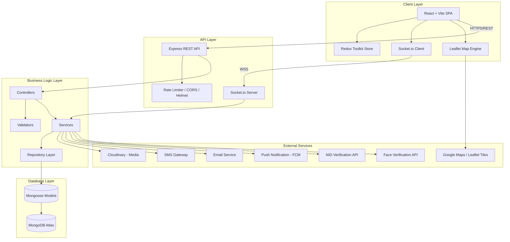
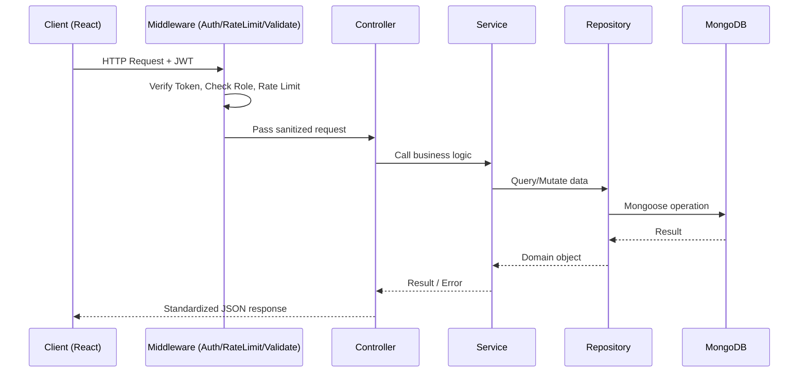
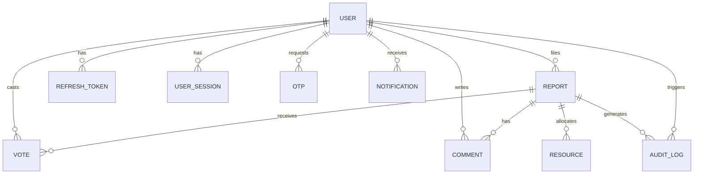
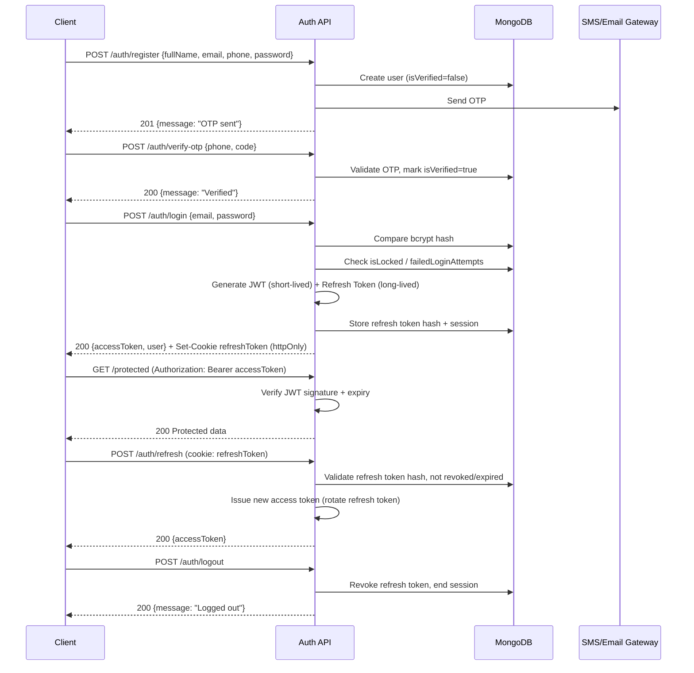
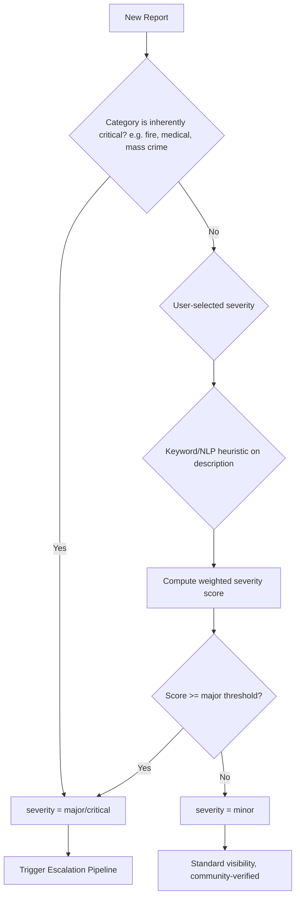
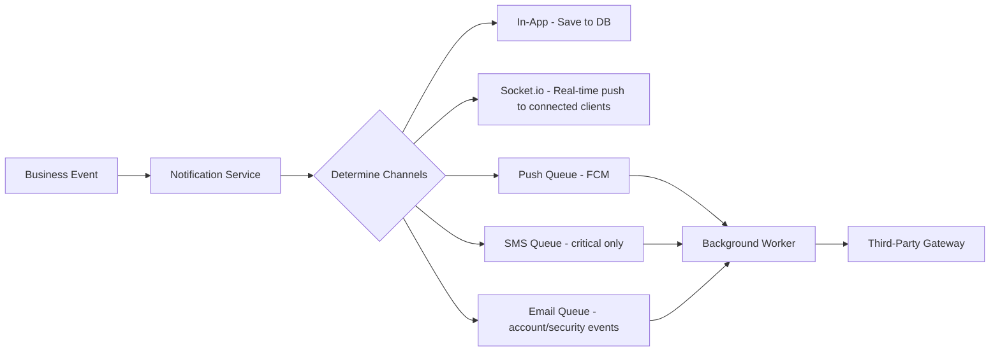
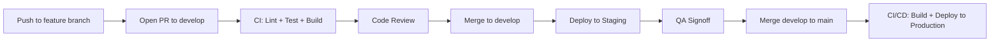

# Protocol Zero — System Architecture Document

**Version:** 1.0
**Stack:** MERN (MongoDB, Express.js, React.js, Node.js)
**Status:** Master Blueprint — Production-Ready Reference

---

## Table of Contents

1. [Project Overview](#1-project-overview)
2. [High-Level Architecture](#2-high-level-architecture)
3. [Recommended Folder Structure](#3-recommended-folder-structure)
4. [Database Architecture](#4-complete-database-architecture)
5. [Authentication Architecture](#5-authentication-architecture)
6. [Authorization (RBAC)](#6-authorization-rbac)
7. [API Architecture](#7-api-architecture)
8. [Business Logic](#8-business-logic)
9. [Real-Time Architecture](#9-real-time-architecture)
10. [Map System](#10-map-system)
11. [Notification System](#11-notification-system)
12. [Security Architecture](#12-security-architecture)
13. [Error Handling](#13-error-handling)
14. [Scalability](#14-scalability)
15. [Development Workflow](#15-development-workflow)
16. [Future Improvements](#16-future-improvements)
17. [Architecture Decisions](#17-architecture-decisions)
18. [Coding Standards](#18-coding-standards)
19. [Recommended NPM Packages](#19-recommended-npm-packages)
20. [Closing Notes](#20-closing-notes)

---

## 1. Project Overview

### 1.1 Purpose

Protocol Zero is a **community-driven incident reporting and emergency response coordination platform**. It allows any citizen to report an incident (crime, accident, fire, flood, medical emergency, public hazard, etc.) in real time, have it geographically verified by nearby users, and — when severity warrants it — automatically escalate the report to registered **Volunteers**, **Response Teams**, and **Admins** for real-world action.

### 1.2 Goals

| Goal | Description |
|---|---|
| Speed | Reduce the time between "incident occurs" and "help is notified" to seconds. |
| Trust | Prevent misuse through reliability scoring, voting, and fake-report detection. |
| Coverage | Work in low-connectivity regions via lightweight payloads and offline-first client design. |
| Coordination | Give Volunteers and Response Teams a single source of truth for active incidents near them. |
| Transparency | Give every user an auditable history of reports, votes, and resolutions. |

### 1.3 Main Users

| Role | Description |
|---|---|
| **Normal User** | Can view nearby reports, vote, comment, and file reports. |
| **Reporter** | A normal user who has filed one or more verified reports; unlocked reputation-based privileges. |
| **Volunteer** | Verified individual who opts in to respond physically to nearby incidents. |
| **Response Team** | Organized units (e.g., fire service liaison, medical first-responders, community security) with elevated dispatch visibility. |
| **Admin** | Manages a region — verifies reports, manages users, and oversees Volunteers/Response Teams. |
| **Super Admin** | Full system control — manages Admins, global configuration, and platform-wide moderation. |

### 1.4 Core Workflow

1. A user witnesses or experiences an incident and opens the app.
2. They submit a **Report** with location (GPS/GeoJSON), category, severity, description, and optional media.
3. The system classifies it as **Major** or **Minor** based on category + user input + heuristic rules.
4. Nearby users receive a **real-time alert** and can **upvote/downvote** to confirm or dispute the report.
5. If severity and confirmation thresholds are met, the system **auto-escalates** to nearby Volunteers and the relevant Response Team, and notifies Admins.
6. Volunteers/Response Teams acknowledge, respond, and update report status in real time.
7. The report is closed with an outcome, which feeds back into the **Reliability Score** of the reporter and the confirming voters.

### 1.5 System Philosophy

- **Trust is earned, not assumed.** Every account, report, and vote contributes to a running trust signal used to prioritize responses and suppress abuse.
- **Location is a first-class citizen.** Nearly every core entity (Report, Volunteer, Response Team) is geospatially indexed for radius and proximity queries.
- **Real-time by default.** Anything that changes the state of an active incident must propagate to relevant clients within seconds via Socket.io, not polling.
- **Fail safe, not fail silent.** Ambiguous or suspicious reports are flagged for human review rather than auto-dismissed or auto-escalated blindly.
- **Modular now, microservice-ready later.** The backend is organized so that Notification, Report, and Auth domains could be extracted into independent services without a rewrite.

---

## 2. High-Level Architecture

### 2.1 Layered Overview



### 2.2 Layer Responsibilities

| Layer | Responsibility |
|---|---|
| **Client Layer** | Rendering, local state, optimistic UI, map visualization, socket subscriptions. |
| **API Layer** | Request entry point, authentication middleware, rate limiting, routing. |
| **Business Logic Layer** | Controllers (thin, HTTP-only) → Services (core logic) → Repositories (data access abstraction). |
| **Database Layer** | MongoDB collections, indexes, schema validation via Mongoose. |
| **External Services** | Anything outside the app's control boundary — media storage, SMS/email/push, maps, identity verification. |

### 2.3 Request Lifecycle



---

## 3. Recommended Folder Structure

### 3.1 Client (`/client`)

```
client/
├── public/
│   ├── favicon.svg
│   └── icons.svg
├── src/
│   ├── api/                  # Axios instance + endpoint definitions
│   │   ├── axiosInstance.js
│   │   ├── authApi.js
│   │   ├── reportApi.js
│   │   └── ...
│   ├── assets/                # Images, static SVGs, fonts
│   ├── components/             # Reusable, dumb UI components
│   │   ├── common/
│   │   ├── forms/
│   │   └── map/
│   ├── features/               # Feature-sliced modules (Redux slice + components together)
│   │   ├── auth/
│   │   ├── reports/
│   │   ├── volunteers/
│   │   ├── notifications/
│   │   └── admin/
│   ├── hooks/                  # Custom hooks (useAuth, useSocket, useGeolocation)
│   ├── layouts/                 # Page shells (DashboardLayout, AuthLayout)
│   ├── pages/                   # Route-level components
│   ├── redux/
│   │   ├── store.js
│   │   └── rootReducer.js
│   ├── routes/                  # Route definitions + PrivateRoute/RoleRoute guards
│   ├── context/                  # SocketContext, ThemeContext
│   ├── utils/                     # Helpers (formatDate, geoUtils, validators)
│   ├── constants/                  # Enums, role names, status codes
│   ├── App.jsx
│   ├── App.css
│   ├── index.css
│   └── main.jsx
├── .gitignore
├── eslint.config.js
├── index.html
├── package.json
└── vite.config.js
```

**Folder responsibilities:**

| Folder | Responsibility |
|---|---|
| `api/` | All Axios calls. No component ever calls `axios` directly. |
| `components/` | Presentation-only, no business/Redux logic beyond props. |
| `features/` | Domain-driven slices — each owns its Redux slice, hooks, and feature-specific components. |
| `hooks/` | Cross-cutting reusable logic (auth state, geolocation, socket subscription). |
| `layouts/` | Shared page chrome (nav, sidebar) wrapping route pages. |
| `redux/` | Store configuration only; slices live inside `features/`. |
| `routes/` | Centralized route table + guards (`<PrivateRoute>`, `<RoleRoute allow={['admin']}>`). |
| `context/` | React Context providers for cross-tree concerns (sockets, theme). |
| `utils/` | Pure functions, no side effects. |
| `constants/` | Single source of truth for enums (roles, report status, categories). |

### 3.2 Server (`/server`)

```
server/
├── config/
│   ├── db.js                  # MongoDB connection
│   ├── cloudinary.js
│   ├── socket.js
│   └── env.js                  # Centralized env variable loader/validator
├── controllers/                 # Thin HTTP handlers
│   ├── auth.controller.js
│   ├── report.controller.js
│   ├── volunteer.controller.js
│   └── ...
├── services/                     # Core business logic
│   ├── auth.service.js
│   ├── report.service.js
│   ├── reliability.service.js
│   ├── notification.service.js
│   └── ...
├── repositories/                  # Data access abstraction over Mongoose
│   ├── user.repository.js
│   ├── report.repository.js
│   └── ...
├── models/                         # Mongoose schemas
│   ├── User.model.js
│   ├── Report.model.js
│   ├── Vote.model.js
│   └── ...
├── routes/
│   ├── auth.routes.js
│   ├── report.routes.js
│   └── index.js                     # Aggregates and mounts all routers
├── middleware/
│   ├── auth.middleware.js
│   ├── role.middleware.js
│   ├── rateLimiter.middleware.js
│   ├── errorHandler.middleware.js
│   └── upload.middleware.js
├── validators/                       # express-validator / zod schemas
│   ├── auth.validator.js
│   └── report.validator.js
├── utils/
│   ├── ApiError.js
│   ├── ApiResponse.js
│   ├── asyncHandler.js
│   └── geo.util.js
├── jobs/                               # Cron / background workers
│   ├── otpCleanup.job.js
│   └── reportEscalation.job.js
├── socket/
│   ├── index.js
│   ├── handlers/
│   │   ├── report.socket.js
│   │   └── notification.socket.js
│   └── rooms.js                          # Room-naming conventions (geo-cells, roles)
├── uploads/                                 # Temp local storage before Cloudinary push
├── logs/
├── package.json
└── server.js
```

**Folder responsibilities:**

| Folder | Responsibility |
|---|---|
| `controllers/` | Parse request, call service, format response. No DB/business logic. |
| `services/` | All business rules (escalation logic, reliability scoring, fake detection). |
| `repositories/` | Only place that talks to Mongoose models directly — enables swapping DB layer later. |
| `models/` | Schema + validation + indexes only. |
| `middleware/` | Cross-cutting request handling. |
| `validators/` | Input schema validation, kept separate from business validation. |
| `jobs/` | Scheduled/background tasks (escalation timeouts, OTP expiry cleanup). |
| `socket/` | All real-time event definitions, isolated from REST controllers. |

---

## 4. Complete Database Architecture

### 4.1 Design Decision — Single User Model with RBAC

Instead of separate `Volunteer`, `Reporter`, `ResponseTeam`, and `Admin` collections, Protocol Zero uses **one `User` collection with a `role` field and role-specific embedded/linked profile data**.

**Why:**
- A person can transition between roles (Normal User → Reporter → Volunteer) without duplicating identity, auth, and trust-score data across collections.
- Authentication, sessions, refresh tokens, and reliability score are role-agnostic — duplicating them per collection would violate DRY and complicate JWT claims.
- Role-specific extra fields (e.g., Volunteer's `skills`, Response Team's `unitType`) are modeled as an optional embedded sub-document (`roleProfile`) rather than a separate collection, since they are 1:1 with the user and queried together with the user almost always.
- RBAC via a `role` enum + `permissions` array keeps authorization centralized and simple to extend (e.g., adding "Moderator" later needs no schema migration).

### 4.2 Collections Overview



### 4.3 User Model

```js
{
  fullName:        { type: String, required: true, trim: true, maxlength: 100 },
  email:           { type: String, required: true, unique: true, lowercase: true, trim: true },
  phone:           { type: String, required: true, unique: true },
  passwordHash:    { type: String, required: true, select: false },
  role: {
    type: String,
    enum: ['user', 'reporter', 'volunteer', 'response_team', 'admin', 'super_admin'],
    default: 'user'
  },
  permissions:     [{ type: String }],   // fine-grained overrides beyond default role permissions
  isVerified:      { type: Boolean, default: false },   // OTP-verified
  isActive:        { type: Boolean, default: true },
  isLocked:        { type: Boolean, default: false },
  failedLoginAttempts: { type: Number, default: 0 },
  lockUntil:       { type: Date },

  reliabilityScore: { type: Number, default: 50, min: 0, max: 100 },
  totalReports:     { type: Number, default: 0 },
  verifiedReports:  { type: Number, default: 0 },
  falseReports:     { type: Number, default: 0 },

  location: {
    type: { type: String, enum: ['Point'], default: 'Point' },
    coordinates: { type: [Number], default: [0, 0] }   // [lng, lat]
  },

  nidVerification: {
    status: { type: String, enum: ['not_submitted', 'pending', 'verified', 'rejected'], default: 'not_submitted' },
    nidNumber: { type: String, select: false },
    documentUrl: { type: String },
    verifiedAt: { type: Date }
  },

  faceVerification: {
    status: { type: String, enum: ['not_submitted', 'pending', 'verified', 'rejected'], default: 'not_submitted' },
    referenceImageUrl: { type: String },
    verifiedAt: { type: Date }
  },

  roleProfile: {
    // Volunteer-specific
    skills: [{ type: String }],
    availabilityStatus: { type: String, enum: ['online', 'offline', 'busy'] },
    // Response Team-specific
    unitType: { type: String, enum: ['fire', 'medical', 'security', 'rescue'] },
    unitCode: { type: String },
    // Admin-specific
    assignedRegion: { type: String }
  },

  avatarUrl:       { type: String },
  fcmTokens:       [{ type: String }],   // for push notifications, multi-device
  lastLoginAt:     { type: Date },

  createdAt: { type: Date, default: Date.now },
  updatedAt: { type: Date, default: Date.now }
}
```

**Indexes:** `email` (unique), `phone` (unique), `location` (2dsphere), `role` (single), compound `{ role: 1, 'roleProfile.availabilityStatus': 1 }` for volunteer-lookup queries.

### 4.4 Report Model

```js
{
  reporter:      { type: ObjectId, ref: 'User', required: true, index: true },
  title:         { type: String, required: true, maxlength: 150 },
  description:   { type: String, required: true, maxlength: 2000 },
  category: {
    type: String,
    enum: ['fire', 'accident', 'crime', 'medical', 'flood', 'natural_disaster', 'public_hazard', 'other'],
    required: true
  },
  severity:      { type: String, enum: ['minor', 'major', 'critical'], required: true },
  status: {
    type: String,
    enum: ['pending', 'verified', 'escalated', 'in_progress', 'resolved', 'rejected', 'false_report'],
    default: 'pending',
    index: true
  },
  isVictimMode:  { type: Boolean, default: false },

  location: {
    type: { type: String, enum: ['Point'], default: 'Point' },
    coordinates: { type: [Number], required: true }   // 2dsphere
  },
  address:        { type: String },

  media: [{
    url: String,
    publicId: String,          // Cloudinary reference
    type: { type: String, enum: ['image', 'video'] }
  }],

  upvotes:        { type: Number, default: 0 },
  downvotes:      { type: Number, default: 0 },
  credibilityScore: { type: Number, default: 0 },   // computed field, see §8.4

  assignedVolunteers:    [{ type: ObjectId, ref: 'User' }],
  assignedResponseTeam:  { type: ObjectId, ref: 'User' },

  escalationRadiusMeters: { type: Number, default: 1000 },
  resolvedAt:  { type: Date },
  resolutionNote: { type: String },

  isFakeFlagged: { type: Boolean, default: false },
  fakeDetectionScore: { type: Number, default: 0 },

  createdAt: { type: Date, default: Date.now },
  updatedAt: { type: Date, default: Date.now }
}
```

**Indexes:** `location` (2dsphere, **required** for radius queries), compound `{ status: 1, severity: 1, createdAt: -1 }`, `reporter` (single).

### 4.5 Vote Model

```js
{
  report:   { type: ObjectId, ref: 'Report', required: true, index: true },
  user:     { type: ObjectId, ref: 'User', required: true },
  voteType: { type: String, enum: ['upvote', 'downvote'], required: true },
  createdAt: { type: Date, default: Date.now }
}
```

**Indexes:** compound unique `{ report: 1, user: 1 }` — prevents duplicate voting.

### 4.6 Comment Model

```js
{
  report:    { type: ObjectId, ref: 'Report', required: true, index: true },
  user:      { type: ObjectId, ref: 'User', required: true },
  text:      { type: String, required: true, maxlength: 500 },
  isOfficial: { type: Boolean, default: false },   // true if from Admin/Response Team
  createdAt: { type: Date, default: Date.now }
}
```

### 4.7 Notification Model

```js
{
  recipient: { type: ObjectId, ref: 'User', required: true, index: true },
  type: { type: String, enum: ['report_nearby', 'escalation', 'vote_update', 'status_change', 'system'], required: true },
  title:     { type: String, required: true },
  message:   { type: String, required: true },
  relatedReport: { type: ObjectId, ref: 'Report' },
  isRead:    { type: Boolean, default: false },
  channel:   { type: String, enum: ['in_app', 'push', 'sms', 'email'], default: 'in_app' },
  createdAt: { type: Date, default: Date.now }
}
```

**Indexes:** compound `{ recipient: 1, isRead: 1, createdAt: -1 }`.

### 4.8 Resource Model

```js
{
  report:    { type: ObjectId, ref: 'Report', required: true },
  type:      { type: String, enum: ['ambulance', 'fire_truck', 'personnel', 'medical_kit', 'shelter'], required: true },
  quantity:  { type: Number, default: 1 },
  status:    { type: String, enum: ['requested', 'dispatched', 'delivered', 'cancelled'], default: 'requested' },
  assignedTo: { type: ObjectId, ref: 'User' },
  createdAt: { type: Date, default: Date.now }
}
```

### 4.9 OTP Model

```js
{
  user:      { type: ObjectId, ref: 'User', required: true },
  code:      { type: String, required: true },
  purpose:   { type: String, enum: ['registration', 'login', 'password_reset', 'phone_change'], required: true },
  expiresAt: { type: Date, required: true },
  isUsed:    { type: Boolean, default: false },
  createdAt: { type: Date, default: Date.now }
}
```

**Indexes:** TTL index on `expiresAt` (`expireAfterSeconds: 0`) — auto-deletes expired OTPs.

### 4.10 Refresh Token Model

```js
{
  user:      { type: ObjectId, ref: 'User', required: true, index: true },
  tokenHash: { type: String, required: true },   // never store raw token
  deviceInfo: { type: String },
  ipAddress:  { type: String },
  expiresAt:  { type: Date, required: true },
  isRevoked:  { type: Boolean, default: false },
  createdAt:  { type: Date, default: Date.now }
}
```

**Indexes:** TTL on `expiresAt`.

### 4.11 User Session Model

```js
{
  user:       { type: ObjectId, ref: 'User', required: true, index: true },
  deviceInfo: { type: String },
  ipAddress:  { type: String },
  userAgent:  { type: String },
  isActive:   { type: Boolean, default: true },
  lastActiveAt: { type: Date, default: Date.now },
  createdAt:  { type: Date, default: Date.now }
}
```

### 4.12 Audit Log Model

```js
{
  actor:      { type: ObjectId, ref: 'User', required: true },
  action:     { type: String, required: true },     // e.g. 'REPORT_STATUS_CHANGE'
  targetType: { type: String },                       // 'Report', 'User'
  targetId:   { type: ObjectId },
  metadata:   { type: Object },                        // diff / before-after snapshot
  ipAddress:  { type: String },
  createdAt:  { type: Date, default: Date.now }
}
```

**Indexes:** compound `{ targetType: 1, targetId: 1, createdAt: -1 }`.

### 4.13 GeoJSON Usage

All location fields use GeoJSON `Point` format `{ type: 'Point', coordinates: [lng, lat] }` with a `2dsphere` index, enabling:

- `$near` / `$geoWithin` radius queries for "reports near me."
- `$geoIntersects` for checking if a report falls inside an Admin's assigned region polygon.

---

## 5. Authentication Architecture

### 5.1 Flow Diagram



### 5.2 Step-by-Step Explanation

| Step | Detail |
|---|---|
| **Registration** | Validates unique email/phone, hashes password with bcrypt (cost factor 12), creates user with `isVerified: false`. |
| **OTP Verification** | 6-digit numeric OTP, 5-minute expiry (TTL-indexed), max 5 verification attempts, resend cooldown of 60s. |
| **Login** | On success, resets `failedLoginAttempts` to 0. On failure, increments counter; at 5 failures, `isLocked = true` with a 15-minute `lockUntil`. |
| **JWT** | Access token: 15-minute expiry, signed with `JWT_ACCESS_SECRET`, contains `{ userId, role, permissions }`. Never stores sensitive data. |
| **Refresh Token** | 7–30 day expiry (configurable "remember me"), stored **httpOnly, secure, sameSite=strict** cookie. Server stores only a **hash** of it, enabling revocation without ever exposing the raw token in the DB. Rotated on every use (old token revoked, new one issued) to detect token theft. |
| **Logout** | Revokes the specific refresh token and marks the `UserSession` inactive. "Logout all devices" revokes all tokens for the user. |
| **Password Reset** | OTP-based (not link-based, to keep parity with phone-first UX) — request → verify OTP → set new password → revoke all existing refresh tokens. |
| **Account Lock** | Auto-unlocks after `lockUntil` passes; Admin can manually unlock. |
| **Rate Limiting** | `/auth/login` and `/auth/register` limited to 10 requests / 15 min per IP via `express-rate-limit`; OTP endpoints limited to 5 requests / 10 min per phone number. |
| **Face Verification (placeholder)** | `POST /auth/face-verification` accepts a selfie, stores to Cloudinary, sets `faceVerification.status = 'pending'`. Actual matching wired to a third-party liveness/face-match API (e.g., AWS Rekognition or a local vendor) — stubbed as an async job until vendor is selected. |
| **NID Verification (placeholder)** | `POST /auth/nid-verification` accepts NID number + document image. Currently stores as `pending`; hook point reserved for a national ID verification API integration. Field is `select: false` by default to avoid ever leaking NID numbers in normal queries. |

---

## 6. Authorization (RBAC)

### 6.1 Permission Matrix

| Action | User | Reporter | Volunteer | Response Team | Admin | Super Admin |
|---|:---:|:---:|:---:|:---:|:---:|:---:|
| View nearby reports | ✅ | ✅ | ✅ | ✅ | ✅ | ✅ |
| Create report | ✅ | ✅ | ✅ | ✅ | ✅ | ✅ |
| Vote / comment | ✅ | ✅ | ✅ | ✅ | ✅ | ✅ |
| Activate Victim Mode | ✅ | ✅ | ✅ | ✅ | ✅ | ✅ |
| Receive escalation alerts | ❌ | ❌ | ✅ | ✅ | ✅ | ✅ |
| Acknowledge / respond to report | ❌ | ❌ | ✅ | ✅ | ✅ | ✅ |
| Change report status | ❌ | ❌ | ✅ (limited) | ✅ | ✅ | ✅ |
| Allocate resources | ❌ | ❌ | ❌ | ✅ | ✅ | ✅ |
| Verify / reject reports | ❌ | ❌ | ❌ | ❌ | ✅ | ✅ |
| Manage users (lock/unlock/verify NID) | ❌ | ❌ | ❌ | ❌ | ✅ (region) | ✅ (global) |
| Promote/demote roles | ❌ | ❌ | ❌ | ❌ | ❌ | ✅ |
| View audit logs | ❌ | ❌ | ❌ | ❌ | ✅ (region) | ✅ (global) |
| System configuration | ❌ | ❌ | ❌ | ❌ | ❌ | ✅ |

### 6.2 Implementation

- `role.middleware.js` exposes `authorize(...allowedRoles)` and `hasPermission(permissionKey)`.
- Default permissions are derived from `role`; the `permissions` array on `User` allows **fine-grained overrides** (e.g., a specific trusted Volunteer granted `resource:allocate` without becoming a full Response Team member).
- Region-scoped Admin authorization checks `req.user.roleProfile.assignedRegion` against the target resource's geolocation via `$geoIntersects`.

---

## 7. API Architecture

APIs are grouped by module. All responses follow the standard envelope (see §13.2). All mutating endpoints require authentication unless marked otherwise.

### 7.1 Auth Module

| Method | Endpoint | Auth | Role | Description |
|---|---|:---:|---|---|
| POST | `/auth/register` | ❌ | — | Register new user |
| POST | `/auth/verify-otp` | ❌ | — | Verify registration/login OTP |
| POST | `/auth/resend-otp` | ❌ | — | Resend OTP |
| POST | `/auth/login` | ❌ | — | Login, returns access token + refresh cookie |
| POST | `/auth/refresh` | Cookie | — | Rotate access token |
| POST | `/auth/logout` | ✅ | Any | Revoke current session |
| POST | `/auth/forgot-password` | ❌ | — | Request password reset OTP |
| POST | `/auth/reset-password` | ❌ | — | Reset password after OTP verification |
| POST | `/auth/face-verification` | ✅ | Any | Submit selfie for face verification |
| POST | `/auth/nid-verification` | ✅ | Any | Submit NID for verification |

**Example — `POST /auth/register`**

Request body:
```json
{ "fullName": "string", "email": "string", "phone": "string", "password": "string" }
```
Validation: `fullName` 2–100 chars; valid email; phone E.164 format; password min 8 chars with 1 number + 1 symbol.
Response `201`:
```json
{ "success": true, "message": "OTP sent to phone", "data": { "userId": "..." } }
```

### 7.2 Report Module

| Method | Endpoint | Auth | Role | Description |
|---|---|:---:|---|---|
| POST | `/reports` | ✅ | Any verified user | Create report |
| GET | `/reports` | ✅ | Any | List reports (filters: category, status, radius) |
| GET | `/reports/:id` | ✅ | Any | Get single report |
| PATCH | `/reports/:id` | ✅ | Owner/Admin | Update report details |
| PATCH | `/reports/:id/status` | ✅ | Volunteer+ | Update report status |
| DELETE | `/reports/:id` | ✅ | Owner/Admin | Soft-delete report |
| GET | `/reports/nearby` | ✅ | Any | Radius-based query (lat, lng, radius) |
| POST | `/reports/:id/vote` | ✅ | Any | Cast upvote/downvote |
| POST | `/reports/:id/comments` | ✅ | Any | Add comment |
| GET | `/reports/:id/comments` | ✅ | Any | List comments |
| POST | `/reports/victim-mode` | ✅ | Any | Trigger high-priority self-report |

**Example — `POST /reports`**

Request body:
```json
{
  "title": "string",
  "description": "string",
  "category": "fire | accident | crime | medical | flood | natural_disaster | public_hazard | other",
  "severity": "minor | major | critical",
  "location": { "lat": 23.79, "lng": 90.41 },
  "media": ["cloudinary_temp_id"]
}
```
Validation required; authentication required; no specific role beyond `isVerified: true`.
Response `201`: created report object + `credibilityScore: 0`.

### 7.3 Volunteer / Response Team Module

| Method | Endpoint | Auth | Role | Description |
|---|---|:---:|---|---|
| POST | `/volunteers/apply` | ✅ | User | Apply to become a Volunteer |
| PATCH | `/volunteers/availability` | ✅ | Volunteer | Toggle online/offline/busy |
| GET | `/volunteers/nearby` | ✅ | Admin/Response Team | List volunteers near a report |
| POST | `/response-teams` | ✅ | Admin | Create a Response Team unit |
| PATCH | `/reports/:id/assign` | ✅ | Admin | Assign volunteers/team to a report |

### 7.4 Notification Module

| Method | Endpoint | Auth | Role | Description |
|---|---|:---:|---|---|
| GET | `/notifications` | ✅ | Any | List paginated notifications |
| PATCH | `/notifications/:id/read` | ✅ | Any | Mark as read |
| PATCH | `/notifications/read-all` | ✅ | Any | Mark all as read |
| POST | `/notifications/register-device` | ✅ | Any | Register FCM token |

### 7.5 Admin Module

| Method | Endpoint | Auth | Role | Description |
|---|---|:---:|---|---|
| GET | `/admin/users` | ✅ | Admin | List/search users |
| PATCH | `/admin/users/:id/lock` | ✅ | Admin | Lock/unlock account |
| PATCH | `/admin/users/:id/verify-nid` | ✅ | Admin | Approve/reject NID |
| PATCH | `/admin/reports/:id/verify` | ✅ | Admin | Verify or reject a report |
| GET | `/admin/audit-logs` | ✅ | Admin | View audit logs |
| PATCH | `/admin/users/:id/role` | ✅ | Super Admin | Change user role |

---

## 8. Business Logic

### 8.1 Report Creation

1. Validate payload (Joi/Zod schema).
2. Reverse-geocode coordinates to human-readable address (async, non-blocking).
3. Run **Fake Report Detection** pre-check (see §8.10) — if score exceeds threshold, flag `isFakeFlagged: true` but still create the report (never silently drop user input).
4. Persist report with `status: 'pending'`.
5. Emit `report:created` Socket.io event to all users within a geo-cell radius.
6. Enqueue an **escalation evaluation job** (see §8.2).

### 8.2 Major vs Minor Report Classification



### 8.3 Escalation Pipeline

- **Major/Critical reports** escalate immediately to Volunteers and Response Teams within `escalationRadiusMeters` (default 1000m, expanding to 3000m if no acknowledgment within 3 minutes).
- **Minor reports** stay in community-verification mode — escalate only if they accumulate `upvotes - downvotes >= 5` **and** `credibilityScore >= 60`.
- Escalation writes an `AuditLog` entry and creates `Notification` documents for every targeted Volunteer/Response Team member, dispatched via Socket.io + push.

### 8.4 Voting & Credibility Score

```
credibilityScore = clamp(
  ((upvotes - downvotes) / max(totalVotes, 1)) * 70
  + (reporter.reliabilityScore / 100) * 30,
  0, 100
)
```

- Recomputed on every vote via an atomic update + post-save hook.
- A report crossing `credibilityScore >= 80` with `totalVotes >= 10` is auto-marked `verified`.
- A report crossing `credibilityScore <= 15` with `totalVotes >= 10` is auto-marked `false_report`, and the reporter's `falseReports` counter increments.

### 8.5 Reliability Score

Applied to a user whenever one of their reports resolves:

| Outcome | Score Change |
|---|---|
| Report verified & resolved successfully | +3 |
| Report resolved but ultimately minor severity | +1 |
| Report marked `false_report` | −10 |
| Vote matches final report outcome | +0.5 |
| Vote contradicts final report outcome | −0.5 |

Score is clamped between 0–100. Users below `reliabilityScore: 20` have their new reports automatically flagged for Admin pre-review before public visibility.

### 8.6 Victim Mode

A one-tap "I am in danger" trigger:

1. Bypasses normal report form — auto-fills location, sets `severity: critical`, `isVictimMode: true`.
2. Skips community-verification step entirely — escalates **immediately** to nearest Response Team + Volunteers + Admin, regardless of the reporter's reliability score.
3. Opens a live location-sharing channel (Socket.io room) so responders can track the victim's movement until resolution.
4. Sends an automatic SMS to a pre-configured emergency contact, if the user has one on file.

### 8.7 Volunteer Participation

- Volunteers set `availabilityStatus`. Only `online` volunteers are eligible for auto-assignment.
- Assignment uses `$nearSphere` query on `User.location` filtered by `role: 'volunteer'` and matching `skills` to `report.category` where applicable (e.g., medical skill for medical category).
- A Volunteer can `acknowledge` (accept), `decline`, or let a request **timeout** (30s) before it cascades to the next-nearest volunteer.

### 8.8 Resource Allocation

- Response Team members create `Resource` entries against a report (`ambulance`, `personnel`, etc.).
- Status transitions: `requested → dispatched → delivered` (or `cancelled`), each transition logged to `AuditLog` and broadcast via Socket.io to the reporter and assigned team.

### 8.9 Notifications (business trigger summary)

| Trigger | Recipients | Channel |
|---|---|---|
| New report nearby | Users within radius | In-app + push |
| Report escalated | Assigned volunteers/team | Push + SMS (critical only) |
| Vote milestone reached | Reporter | In-app |
| Status changed | Reporter + assigned responders | In-app + push |
| Account locked / NID rejected | Affected user | Email |

### 8.10 Report Verification & Fake Report Detection

**Verification** is a combination of automated (§8.4 credibility score) and manual Admin review for flagged/ambiguous cases.

**Fake Detection heuristic (rule-based baseline, ML-upgradeable):**

| Signal | Weight |
|---|---|
| Reporter's `reliabilityScore < 20` | High |
| Report location > 50km from reporter's registered/typical location | Medium |
| Duplicate report (same category + location within 100m within 10 minutes) | High |
| No media attached for a "major"/"critical" severity claim | Medium |
| Description contains flagged keyword patterns (spam/test/joke) | Medium |
| Rapid-fire report submission (>3 reports in 5 minutes by same user) | High |

Each signal contributes to `fakeDetectionScore` (0–100); `>= 60` sets `isFakeFlagged: true` and routes the report to an Admin review queue instead of public feed visibility.

---

## 9. Real-Time Architecture

### 9.1 Socket.io Room Strategy

Rooms are namespaced by **geo-cell** (coarse geohash of the user's location, e.g., 3km precision) and by **role**, so events are broadcast only to relevant sockets rather than globally.

```
geo:{geohash}           -> all users physically near a location
role:volunteer          -> all online volunteers (global)
role:response_team      -> all response team members
user:{userId}           -> personal notification channel
report:{reportId}       -> live room for viewers/responders of one active report
```

### 9.2 Events

| Event | Direction | Payload | Purpose |
|---|---|---|---|
| `report:created` | Server → Room `geo:{cell}` | Report summary | New nearby report |
| `report:escalated` | Server → Room `role:volunteer`/`role:response_team` | Report + distance | Escalation alert |
| `report:statusChanged` | Server → Room `report:{id}` | New status | Live status update |
| `report:voteUpdate` | Server → Room `report:{id}` | Vote tallies | Live credibility update |
| `victim:locationUpdate` | Client → Server → Room `report:{id}` | Coordinates | Live victim tracking |
| `volunteer:acknowledge` | Client → Server | reportId | Volunteer accepts dispatch |
| `chat:typing` | Client → Server → Room `report:{id}` | userId | Typing indicator (incident chat) |
| `notification:new` | Server → Room `user:{id}` | Notification object | Real-time personal alert |

### 9.3 Connection Handling

- On socket connection, client authenticates via JWT passed in the `auth` handshake payload.
- Server joins the socket to `user:{id}`, `role:{role}`, and the current `geo:{cell}` room (recomputed as the user moves, via a throttled `geo:updateLocation` event).
- Disconnection updates `availabilityStatus` to `offline` for Volunteers after a grace period (handles flaky mobile connections).

---

## 10. Map System

### 10.1 Technology Choice

**Recommendation: Leaflet + OpenStreetMap tiles**, with Google Maps API as an optional paid upgrade path.

| Criterion | Leaflet (OSM) | Google Maps API |
|---|---|---|
| Cost | Free | Paid beyond free tier |
| Customization | Fully open, plugin ecosystem (heatmap, clustering) | Good but more restricted |
| Offline/PWA friendliness | Better (tile caching feasible) | Harder due to ToS |
| Data quality (Bangladesh region) | Good via OSM contributors | Very good |

Leaflet is recommended as the default for cost control and open-source alignment with the MERN stack; Google Maps API remains a drop-in alternative if premium geocoding/traffic data becomes necessary.

### 10.2 Core Capabilities

- **GeoJSON everywhere**: reports, volunteers, and response team locations all stored/queried as GeoJSON Points.
- **Radius Search**: `$geoWithin`/`$centerSphere` or `$nearSphere` queries power "show reports within X km."
- **Nearby Reports Feed**: default 5km radius, adjustable by user.
- **Heatmaps**: `leaflet.heat` plugin visualizes report density over time (incident hotspots).
- **Clustering**: `react-leaflet-cluster` groups markers at low zoom to avoid clutter in dense areas.
- **Marker Color Coding**:

| Marker Color | Meaning |
|---|---|
| 🔴 Red | Critical / Victim Mode |
| 🟠 Orange | Major |
| 🟡 Yellow | Minor (unverified) |
| 🟢 Green | Verified / Resolved |
| ⚫ Grey | False report / Rejected |

- **Victim Markers**: pulsing animated marker with live-tracking trail line.
- **Major Incident Radius**: a translucent circle overlay showing `escalationRadiusMeters`, so nearby volunteers visually gauge proximity/urgency.

---

## 11. Notification System

### 11.1 Architecture



### 11.2 Components

| Component | Responsibility |
|---|---|
| **In-app** | Persisted `Notification` documents, fetched via REST, marked read/unread. |
| **Socket Notifications** | Real-time delivery to currently-connected clients on `user:{id}` room. |
| **Push Notifications** | FCM tokens registered per device; delivered even when app is backgrounded/closed. |
| **Background Notification Queue** | A job queue (in-memory `Bull`/Redis-backed, or simple Mongo-backed queue for v1) decouples notification dispatch from the request/response cycle so a slow SMS gateway never blocks report creation. |

### 11.3 Flow

1. A business event occurs (e.g., report escalated).
2. `notification.service.js` creates the `Notification` document(s).
3. Emits via Socket.io immediately for connected clients.
4. Enqueues push/SMS/email jobs for offline-capable delivery.
5. Worker (`jobs/notificationDispatch.job.js`) processes the queue with retry-with-backoff on gateway failure.

---

## 12. Security Architecture

| Concern | Mitigation |
|---|---|
| **JWT** | Short-lived (15 min) access tokens, signed with a strong secret, `RS256` recommended for future multi-service verification. |
| **Refresh Tokens** | httpOnly + secure + sameSite cookies; hashed at rest; rotated on each refresh; revocable per-session. |
| **Helmet** | Applied globally to set secure HTTP headers (CSP, X-Frame-Options, HSTS). |
| **CORS** | Whitelist explicit client origin(s) only; credentials: true for cookie-based refresh flow. |
| **XSS** | React's default escaping + `express-mongo-sanitize` + output encoding for any rendered user content (comments, descriptions). |
| **CSRF** | Since auth uses `Authorization: Bearer` header for access tokens (not auto-sent by browser) CSRF risk is low; the refresh-token cookie route additionally validates a custom header (`X-Requested-With`) as defense-in-depth. |
| **Password Hashing** | bcrypt, cost factor 12, never log or return password hash. |
| **Rate Limiting** | `express-rate-limit` per-route tiers: strict on auth/OTP, moderate on report creation, lenient on read endpoints. |
| **Input Validation** | `express-validator`/Zod schemas on every mutating endpoint; reject unknown fields. |
| **File Upload Security** | `multer` with file-type whitelist (jpg/png/mp4), 10MB size cap, virus-scan hook point, direct-to-Cloudinary upload to avoid storing untrusted files on the server disk. |
| **Image Validation** | MIME-type + magic-number verification (not just extension), Cloudinary moderation add-on for explicit content detection. |
| **Logging** | `winston` for structured server logs (info/warn/error), `morgan` for HTTP access logs, PII redacted from logs. |
| **Audit Trails** | Every privileged action (status change, role change, account lock, verification decision) recorded in `AuditLog` with actor, timestamp, and before/after diff. |

---

## 13. Error Handling

### 13.1 Global Error Handler

A single Express error-handling middleware (registered last) catches all errors — thrown, rejected promises (via `asyncHandler` wrapper), and Mongoose errors — and formats them consistently.

```js
// utils/ApiError.js
class ApiError extends Error {
  constructor(statusCode, message, errors = []) {
    super(message);
    this.statusCode = statusCode;
    this.errors = errors;
    this.success = false;
  }
}
```

### 13.2 Standard API Response Format

**Success:**
```json
{
  "success": true,
  "message": "Report created successfully",
  "data": { }
}
```

**Error:**
```json
{
  "success": false,
  "message": "Validation failed",
  "errors": [ { "field": "phone", "message": "Invalid phone number" } ]
}
```

### 13.3 Error Categories

| Type | HTTP Code | Example |
|---|---|---|
| Validation Error | 400 | Missing required field |
| Authentication Error | 401 | Invalid/expired token |
| Authorization Error | 403 | Insufficient role/permission |
| Not Found | 404 | Report ID doesn't exist |
| Conflict | 409 | Duplicate vote, duplicate email |
| Rate Limited | 429 | Too many OTP requests |
| Database Error | 500 | Mongoose connection/query failure (never exposes raw driver error to client) |

---

## 14. Scalability

| Strategy | Application |
|---|---|
| **Modular Architecture** | Controller → Service → Repository separation allows any layer to be replaced or extracted independently. |
| **Service Layer** | All business rules centralized; controllers stay HTTP-only, enabling reuse across REST, sockets, and future GraphQL/gRPC layers. |
| **Repository Pattern** | Abstracts Mongoose specifics — a future migration to a different ODM/DB requires touching only `repositories/`. |
| **Redis (future)** | Session/refresh-token store, Socket.io adapter for horizontal scaling across multiple Node instances, and a real job queue (BullMQ) backend. |
| **Message Queue (future)** | RabbitMQ/SQS for notification dispatch and heavy async jobs (e.g., fake-detection ML inference) decoupled from the API process. |
| **Microservice Readiness** | Auth, Report, and Notification domains are already logically isolated (own services/repositories) — extractable into separate deployables behind an API gateway without rewriting business logic. |
| **Caching** | Frequently-read, slow-changing data (e.g., region config, category lists) cached in Redis/in-memory LRU; report feeds cached briefly (10–30s) per geo-cell. |
| **CDN** | All static client assets and Cloudinary media served via CDN edge caching by default. |

---

## 15. Development Workflow

### 15.1 Git Branch Strategy

```
main            → production-ready, protected, deploy-on-merge
develop         → integration branch for the next release
feature/*       → new features (feature/victim-mode)
fix/*           → bug fixes (fix/otp-expiry)
hotfix/*        → urgent production patches, branched from main
release/*       → release stabilization branches
```

### 15.2 Commit Convention

Follows **Conventional Commits**:

```
feat(reports): add victim mode escalation
fix(auth): correct refresh token rotation bug
docs(readme): update setup instructions
refactor(services): extract reliability scoring logic
chore(deps): bump mongoose to 8.x
```

### 15.3 Environment Variables

```
# Server
PORT=5000
NODE_ENV=development
MONGO_URI=
JWT_ACCESS_SECRET=
JWT_REFRESH_SECRET=
JWT_ACCESS_EXPIRY=15m
JWT_REFRESH_EXPIRY=7d
CLOUDINARY_CLOUD_NAME=
CLOUDINARY_API_KEY=
CLOUDINARY_API_SECRET=
SMS_GATEWAY_API_KEY=
EMAIL_SMTP_HOST=
FCM_SERVER_KEY=
CLIENT_ORIGIN=

# Client
VITE_API_BASE_URL=
VITE_SOCKET_URL=
VITE_MAP_TILE_PROVIDER=
```

### 15.4 Build Process

- Client: `vite build` → static assets → served via CDN/static host (Vercel/Netlify) or served by Express in a single-deploy setup.
- Server: transpile-free Node (ESM/CommonJS as configured), `pm2` or containerized process management.

### 15.5 Deployment Flow



---

## 16. Future Improvements

| Feature | Value |
|---|---|
| **Duplicate Report Detection** | Cluster reports by geo + time + category to auto-merge duplicates, reducing noise. |
| **AI-Assisted Report Classification** | NLP model to auto-suggest category/severity from free-text description. |
| **Image Moderation** | Auto-flag graphic/inappropriate media via vision moderation API. |
| **Spam Detection** | Behavioral pattern analysis beyond the rule-based baseline in §8.10. |
| **Trust Score / User Reputation Badges** | Visible reputation tiers (Bronze/Silver/Gold Reporter) to gamify accurate reporting. |
| **Analytics Dashboard** | Region-wise incident trends, response time metrics, for Admins/Super Admins. |
| **Admin Dashboard** | Dedicated web console for verification queues, user management, audit logs. |
| **Incident Timeline** | Chronological event log per report (created → voted → escalated → resolved). |
| **Report History Export** | CSV/PDF export of a user's or region's report history. |
| **Offline Support (PWA)** | Queue report submissions locally when offline, sync on reconnect. |
| **SMS Integration Expansion** | Two-way SMS reporting for users without smartphones/data. |
| **Email Digest** | Weekly summary of community incidents in the user's area. |
| **Multi-language Support** | i18n for Bengali/English at minimum. |
| **Disaster Prediction Integration** | Ingest weather/seismic APIs to proactively warn regions (flood/cyclone forecasts). |
| **Resource Optimization Engine** | Predictive allocation of ambulances/personnel based on historical incident density. |

---

## 17. Architecture Decisions

| # | Original Idea (implied) | Recommended Change | Rationale | Trade-off |
|---|---|---|---|---|
| 1 | Separate collections per role (Volunteer, Reporter, etc.) | Single `User` collection with `role` + RBAC | Avoids identity duplication, simplifies auth, supports role transitions | Slightly larger documents; mitigated by `roleProfile` sub-document being optional/sparse |
| 2 | Poll-based updates for report status | Socket.io real-time rooms | True real-time is core to the product's value proposition | Requires sticky sessions or Redis adapter when scaling horizontally |
| 3 | Link-based password reset | OTP-based reset | Matches phone-first UX common in the target market; consistent verification pattern across the app | Slightly less convenient than a magic link on desktop |
| 4 | Store raw refresh tokens | Store only hashed refresh tokens, rotate on use | Prevents DB-leak token theft, standard OAuth2-style security practice | Marginal extra compute per refresh (negligible) |
| 5 | Auto-escalate every "major" report instantly to Admins directly | Escalate to Volunteers/Response Teams first, Admin notified in parallel (not gatekeeping) | Reduces response latency — Admins shouldn't be a bottleneck for time-critical dispatch | Admins have less pre-filtering control; mitigated by audit logs + post-hoc review |
| 6 | Client directly calls third-party map/SMS APIs | All third-party calls proxied through backend services | Keeps API keys server-side, enables centralized rate control and logging | Slightly higher backend load |

---

## 18. Coding Standards

| Category | Convention |
|---|---|
| **Variables/Functions** | `camelCase` (`getUserById`) |
| **Classes/Components** | `PascalCase` (`ReportCard.jsx`, `ApiError`) |
| **Constants/Enums** | `UPPER_SNAKE_CASE` (`MAX_LOGIN_ATTEMPTS`) |
| **Files (React components)** | `PascalCase.jsx` (`ReportForm.jsx`) |
| **Files (utils/services)** | `camelCase.js` (`geoUtils.js`, `report.service.js`) |
| **Folders** | `kebab-case` or `camelCase`, consistent within each layer (`response-team/`) |
| **API Routes** | plural nouns, kebab-case (`/response-teams`, `/nid-verification`) |
| **MongoDB Collections** | PascalCase singular model name → pluralized lowercase collection (`Report` → `reports`) |
| **MongoDB Fields** | `camelCase` |
| **Environment Variables** | `UPPER_SNAKE_CASE` |
| **Git Branches** | `type/short-description` (`feat/victim-mode`) |
| **Commits** | Conventional Commits format |
| **Redux Slices** | Named after feature, state shape documented at top of slice file |

---

## 19. Recommended NPM Packages

### 19.1 Client

| Package | Purpose |
|---|---|
| `react-router-dom` | Client-side routing |
| `axios` | HTTP client with interceptors for token refresh |
| `@reduxjs/toolkit` | Predictable global state management |
| `react-redux` | React bindings for Redux |
| `react-hook-form` | Performant form state management |
| `zod` | Schema validation shared conceptually with backend validators |
| `socket.io-client` | Real-time communication |
| `leaflet` + `react-leaflet` | Interactive maps |
| `react-leaflet-cluster` | Marker clustering |
| `leaflet.heat` | Heatmap visualization |
| `react-hot-toast` | Non-blocking notifications/toasts |
| `date-fns` | Lightweight date formatting |
| `framer-motion` | UI animation (victim marker pulse, transitions) |
| `js-cookie` | Cookie helper for client-side needs |

### 19.2 Server

| Package | Purpose |
|---|---|
| `express` | Web framework |
| `mongoose` | MongoDB ODM |
| `bcryptjs` | Password hashing |
| `jsonwebtoken` | JWT issuing/verification |
| `socket.io` | Real-time server |
| `multer` | Multipart form/file upload handling |
| `cloudinary` | Media storage/CDN |
| `express-validator` | Request validation |
| `helmet` | Secure HTTP headers |
| `cors` | Cross-origin resource sharing control |
| `express-rate-limit` | Abuse/rate limiting |
| `express-mongo-sanitize` | NoSQL injection prevention |
| `dotenv` | Environment variable loading |
| `cookie-parser` | Parse httpOnly refresh-token cookies |
| `morgan` | HTTP request logging |
| `winston` | Application logging |
| `node-cron` | Scheduled jobs (OTP cleanup, escalation timeouts) |
| `twilio` (or local SMS gateway SDK) | SMS/OTP delivery |
| `nodemailer` | Email delivery |
| `firebase-admin` | Push notifications (FCM) |
| `compression` | Response gzip compression |

---

## 20. Closing Notes

This document is the authoritative architecture reference for Protocol Zero. Any deviation from it during implementation — new collections, new endpoints, changed business rules — should be reflected back into this file via a pull request, keeping it a living source of truth for the engineering team.

**Build order recommendation for the team:**

1. Auth module (register → OTP → login → JWT/refresh) end-to-end.
2. Core Report CRUD + GeoJSON storage + nearby query.
3. Voting/Comments + credibility scoring.
4. Socket.io real-time layer (report events first, then notifications).
5. Volunteer/Response Team assignment + escalation pipeline.
6. Map UI (Leaflet, clustering, heatmap).
7. Notification system (in-app → push → SMS/email).
8. Admin dashboard + audit logs.
9. Security hardening pass + rate limiting audit.
10. Future-improvements backlog grooming.
